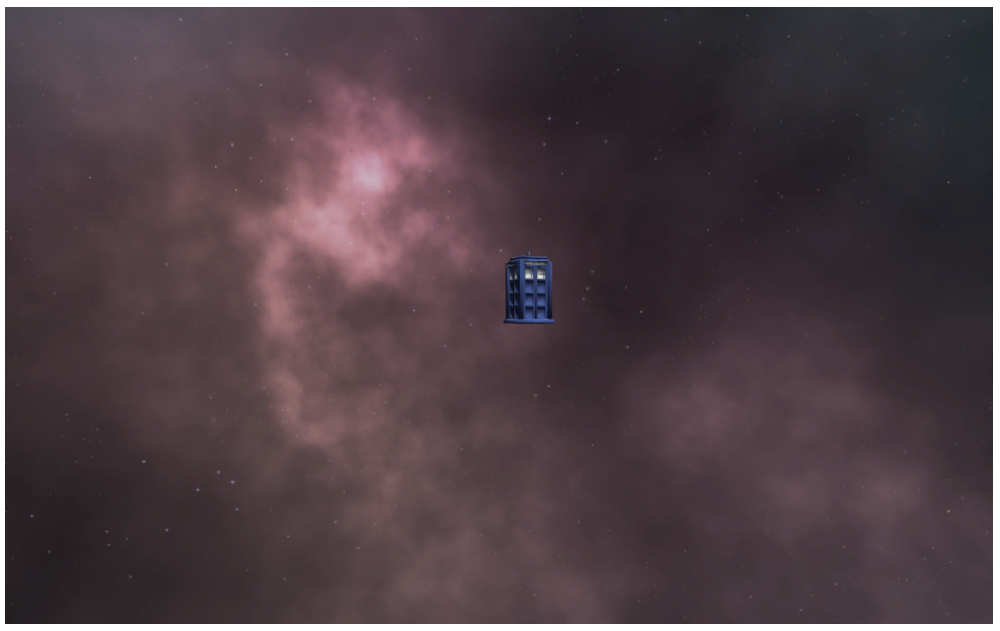

# CSCI 712 Assignment 0: Framework

 Goal: Create the framework and testbed for the animation techniques to be explored during the semester.   
 Made by Simarjot Khanna under the supervision of Prof. Joe Geigel, D.Sc

## What does it do or the task at hand?

¤Animate a simple object (I.e. cube or teapot) using a mathematical expression to describe motion.  
¤20 second animation  
¤X position = 5t (t is time in sec)  
¤Y position = 5t (t is time in sec)  
¤Z position = constant  
¤Rotation around Y axis = 18t (t is time in sec) –in degrees  
¤Rotation around X and Z axis = 0.

## A note about the camera placement

¤Place camera for a straight-on view of object    
¤Camera position / lookat to remain static.    
¤Assure that object does not go outside of view window.

## Additional Mechanic

Once the animation ends, to replay it simply press on the replay button on the top-left edge of the screen.

## Screenshot

